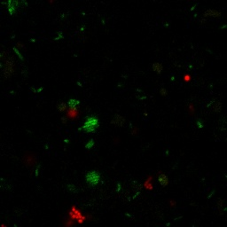
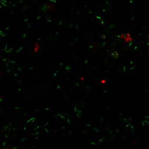
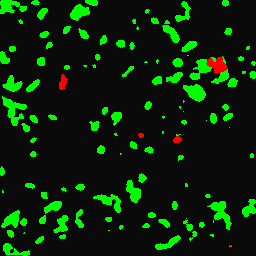
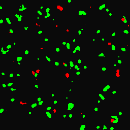
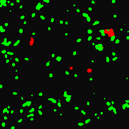

# Unsupervised Semantic Segmentation on Cell Morphology

This is a **computer vision** project aiming to capture semantic sturcture for cell morphology.
The method is based on two unsupervised segmentation technique described in the following papers:
1. Unsupervised Segmentation:  
https://kanezaki.github.io/pytorch-unsupervised-segmentation/ICASSP2018_kanezaki.pdf
2. Semantic Instance Segmentation:  
https://arxiv.org/pdf/1708.02551.pdf

By extending the concept from superpixel clustering, this work adds discriminative loss on the total loss for regularization; and train the network with batch-wise data instead of single data.

Hence, there are two modes to train: \<single>, \<all>
>
    single : train on only single image (one-shot learning)
    all    : train on batch of images

## Results

Original image:  

Segmentation from model trained with single image:  

Segmentation from model trained with all images:  

## To use:
1. First go to `config.py` to change model_mode between single and all
2. Training based on the `images/` folder
>
    python main.py -m train
3. Testing the images in the `images/`:
>
    python main.py -m test

