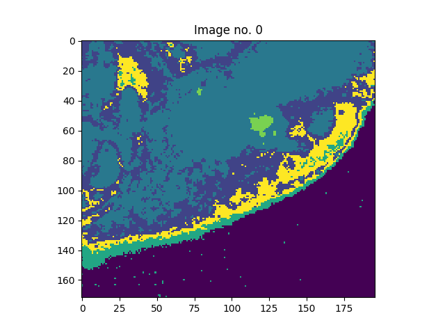
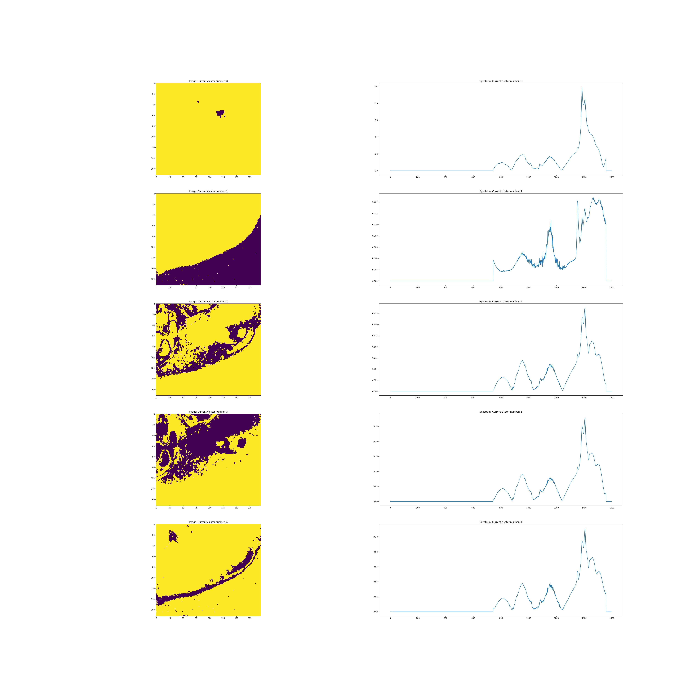

# Cell Image Segmentation from Raman Spectroscopy

This is a computer vision project to segment images based on the pixel-wise raman spectroscopy data.  
The structure follows 1D-conv autoencoder with Kmeans and [deep embedding clustering](http://proceedings.mlr.press/v48/xieb16.pdf) to cluster pixels in reasonable clusters.

# Results

The results are stored in ``results/``

Image 1

 

Image 2

Mean spectra for each cluster:

# To use the codes

**Autoencoder + Kmeans analysis**

Please follow the pipeline in jupyter notebooks for [image1](./autoencoder.ipynb) and [image2](./autoencoder_2.ipynb)

**Deep Embedding Clustering analysis**

1. Change ``model_type`` and ``mode`` for image1 or image2  
2. Check parameters in ``config.py``
2. To train: in ``main.py`` use train  
   To save results: in ``main.py`` use test; it will save in ``graph/results-dcec``
    >
        python main.py
4. To save figures that compares spectra results in each cluster, run the following. It will save all the results in ``graph/results.pkl`` and figures in ``graph/results-dcec/`` and ``graph/results-kmeans/``.
    >
        python postprocess.py
    

